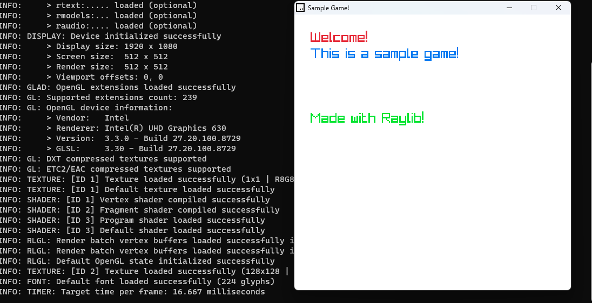

# Minimal Raylib development environment in vscode (Windows)

For many starters including myself, it is a little bit hard to gather everything together, in order to start developing in raylib. Here is the minimal vscode setup, in order to start developing games in raylib easily!
 
## How to use?

1. Make sure raylib is already installed in `C:\raylib`
2. clone the repository, and start coding in `src\sample.cpp`
3. press `F5` in vscode to run

Everything under `src` folder (`src/**/*.cpp src/**/*.h`) will be compiled!

Happy coding!

*please note, it is only tested on windows*